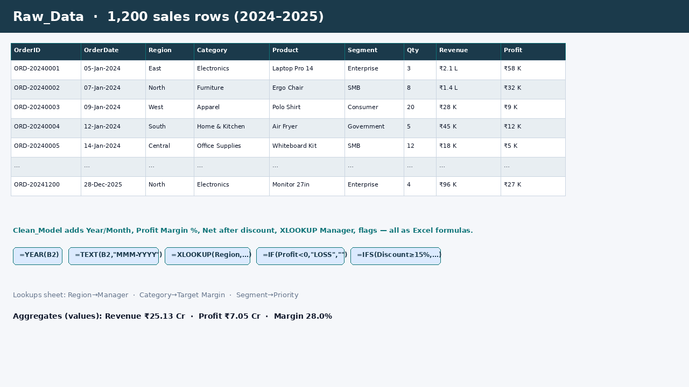
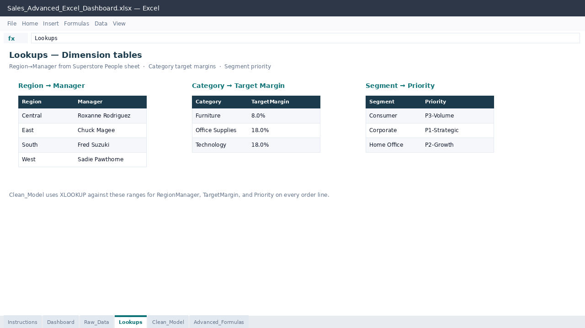
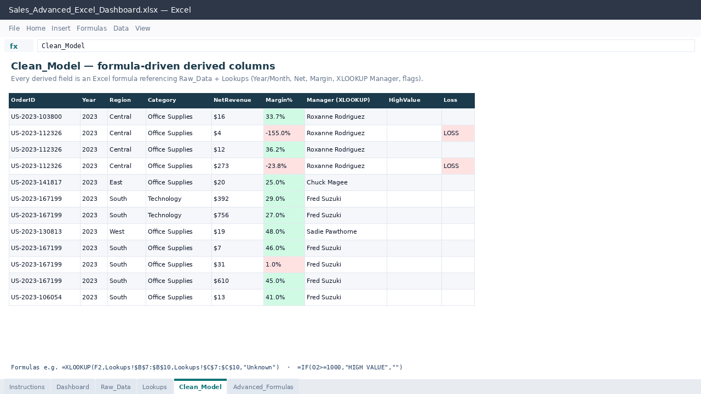

# Sales Advanced Excel — Portfolio Project

**GitHub:** [shanitripathi417-code](https://github.com/shanitripathi417-code)

A multi-sheet Excel workbook that demonstrates **lookup models, multi-criteria aggregations, derived metrics, conditional formatting, and an executive dashboard** — with **real Excel formulas in cells** (not pre-baked values only). Built for interview walkthroughs.

| Artifact | Path |
|---|---|
| Workbook | [`Sales_Advanced_Excel_Dashboard.xlsx`](./Sales_Advanced_Excel_Dashboard.xlsx) |
| Demo video (silent, ~25s, 1280×720) | [`artifacts/sales-advanced-excel-demo.mp4`](./artifacts/sales-advanced-excel-demo.mp4) |
| Screenshots | [`screenshots/`](./screenshots/) |
| Source data (CSV export) | [`data/sample_superstore_orders.csv`](./data/sample_superstore_orders.csv) |

> **Open in Microsoft Excel** (desktop or Excel 365). Formulas recalculate live. Currency formats use **USD** (Tableau Sample Superstore is a U.S. retail sample).

---

## Problem → what this is

Hiring panels for MIS / analyst roles often ask candidates to prove they can **model facts + dimensions**, write **multi-criteria aggregations**, and explain a **dashboard that is formula-driven** rather than pasted numbers.

This project takes a **public retail sales dataset**, maps it into a star-style Excel model, and keeps advanced patterns (XLOOKUP, SUMIFS, RANK, YoY, dynamic arrays) as **live cell formulas** so an interviewer can change a parameter and watch results update.

---

## Skills shown

- Fact / dimension modeling in Excel (Raw_Data + Lookups → Clean_Model → Dashboard)
- Lookup patterns: **XLOOKUP**, **VLOOKUP**, **INDEX/MATCH**
- Aggregations: **SUMIFS / COUNTIFS / AVERAGEIFS / MAXIFS / MINIFS**
- Logic & flags: **IF / IFS**, high-value / loss / discount bands
- Dates: **YEAR / MONTH / TEXT / EOMONTH / DATE**
- Array-ish patterns: **SUMPRODUCT**, **TEXTJOIN**, **RANK**, running totals, YoY
- Optional Excel 365: **UNIQUE / SORT / FILTER**
- Conditional formatting on margin and margin-vs-target
- Chart-backed executive dashboard (Region, Category, Monthly trend, Segment mix)

Evidence only — no fabricated KPI claims beyond what the Superstore file contains.

---

## Sheet map

| # | Sheet | Purpose |
|---|---|---|
| 1 | **Instructions** | How to use + interview talking points + data attribution |
| 2 | **Dashboard** | KPI cards + 4 charts (Region, Category, Monthly trend, Segment mix) |
| 3 | **Raw_Data** | **10,194** Tableau Sample Superstore order lines (2023–2026) — source fact table |
| 4 | **Lookups** | Region→Manager (People sheet), Category→Target Margin, Segment→Priority |
| 5 | **Clean_Model** | Derived columns via formulas referencing `Raw_Data` + `Lookups` |
| 6 | **Advanced_Formulas** | Interview showcase panel: labels + working formulas + parameters |

```
Raw_Data (facts) ──► Clean_Model (formulas + XLOOKUP) ──► Dashboard (KPIs/charts)
Lookups (dims)  ──┘                          └──► Advanced_Formulas (demos)
```

---

## Where advanced functions live

### `Clean_Model` (row formulas on every order line)

| Pattern | Example role |
|---|---|
| `YEAR` / `MONTH` | Calendar attributes from `OrderDate` |
| `TEXT` | `MonthName` as `MMM-YYYY` |
| Arithmetic | Gross = Qty×UnitPrice; Net = Gross×(1−Discount); Profit = Net−Cost |
| `IF` | Profit margin %; High-value flag (≥ **$1,000**) |
| `XLOOKUP` | Region → Manager; Category → Target Margin; Segment → Priority |
| `IFS` | Discount band: Deep / Moderate / Standard |
| Conditional formatting | Margin % green ≥20% / red <10%; Margin vs Target |

Unit price is recovered as `Sales ÷ Quantity ÷ (1 − Discount)` so Clean_Model Net ≈ Raw Sales.

### `Advanced_Formulas` (parameter-driven showcase)

Change amber cells **C6** (Region), **C7** (Category), **C8** (Year), **C9** (High-value threshold) — results update.

| Function | Demo |
|---|---|
| **SUMIFS** | Revenue by Region; Revenue by Region+Category |
| **COUNTIFS** | Orders by Region+Year; High-value order count |
| **AVERAGEIFS** | Corporate AOV; Margin % by Category+Year |
| **MAXIFS / MINIFS** | Peak / smallest order |
| **XLOOKUP** | Manager for selected Region |
| **INDEX / MATCH** | Target margin for selected Category |
| **VLOOKUP** | Classic manager lookup (side-by-side with XLOOKUP) |
| **IFS** | Region tier label |
| **Nested IF** | Star / Solid / Watch performance band |
| **TEXT** + **DATE** | Period label; calendar year start |
| **EOMONTH** | Month-end for Jan of selected year |
| **SUMPRODUCT** | Approx unique customers; weighted margin |
| **TEXTJOIN** | Pipe-joined region list |
| **RANK** | Regions ranked by revenue |
| **Running total** | Cumulative monthly revenue for selected year |
| **YoY** | 2026 vs 2025 revenue growth via SUMIFS ratio |
| **IFERROR** | Safe margin divide |

### Optional Excel 365 dynamic arrays

On `Advanced_Formulas` (bottom section): `UNIQUE`, `SORT(UNIQUE(...))`, `FILTER` for high-value OrderIDs.

These formulas are written into the workbook. **Open in Excel 365** (or Excel 2021+ with dynamic arrays) to see spill results. Older Excel may show `#NAME?` / limited support — that is expected, not a broken file.

> This project does **not** claim “100% of all Excel functions.” It focuses on the aggregation, lookup, logic, and date patterns most often asked in MIS / analyst interviews.

---

## Dashboard gallery

**KPIs (formula-driven):** Total Revenue · Total Profit · Profit Margin % · Order Lines · AOV (line)

**Charts:**

1. Revenue by Region (column)
2. Revenue by Category (bar)
3. Monthly Revenue Trend (line, 2023–2026)
4. Segment Mix (pie)

Chart source tables live in columns **M–O** on `Dashboard` (also formula-driven via `SUMIF` / `SUMIFS`).

### Executive dashboard


### Advanced formulas panel


### Raw data preview



### Lookups (dimension tables)



### Clean model (derived formula columns)



---

## Data source & attribution

| | |
|---|---|
| **Dataset** | [Tableau Sample Superstore](https://public.tableau.com/app/learn/sample-data) (Orders + People sheets) |
| **Official download** | [sample_-_superstore.xls](https://public.tableau.com/app/sample-data/sample_-_superstore.xls) |
| **Local copies** | `data/sample_superstore.xls`, `data/sample_superstore_orders.csv`, `data/sample_superstore_people.csv` |
| **License / terms** | Tableau sample / demo data for a **fictitious** company, published for public learning and portfolio use via Tableau Public sample data. Not an employer dataset. |
| **Rows after clean** | **10,194** order lines (no downsampling) |
| **Date span** | 2023-01-03 → 2026-12-30 |
| **Currency** | **USD** |
| **Regions** | Central, East, South, West |
| **Categories** | Furniture, Office Supplies, Technology |
| **Segments** | Consumer, Corporate, Home Office |
| **Managers** | From Superstore **People** sheet (Sadie Pawthorne, Chuck Magee, Roxanne Rodriguez, Fred Suzuki) |

### Column mapping into the workbook model

| Superstore field | Workbook field |
|---|---|
| Order ID | OrderID |
| Order Date | OrderDate |
| Region | Region |
| Category | ProductCategory |
| Product Name | Product |
| Segment | CustomerSegment |
| Customer Name | Customer |
| Quantity | Quantity |
| Sales ÷ Qty ÷ (1−Discount) | UnitPrice (recovered list price) |
| Discount | Discount |
| Sales | Revenue |
| Sales − Profit | Cost |
| Profit | Profit |
| State/Province | State |
| Sub-Category | SubCategory |

Target margins on `Lookups` are **portfolio stretch targets** for Margin-vs-Target demos (Furniture 8%, Office Supplies / Technology 18%) — not claims from Tableau.

---

## How to open

1. Download [`Sales_Advanced_Excel_Dashboard.xlsx`](./Sales_Advanced_Excel_Dashboard.xlsx).
2. Open in **Microsoft Excel** (desktop or Excel 365).
3. Start on **Dashboard**, then change amber parameters on **Advanced_Formulas**.
4. Optional: watch the silent demo in [`artifacts/sales-advanced-excel-demo.mp4`](./artifacts/sales-advanced-excel-demo.mp4).

Rebuild from source (Python):

```bash
source .venv/bin/activate
python build_workbook.py
python generate_screenshots.py
```

---

## Interview walkthrough (≈3–5 min)

1. **Dashboard** — “Here’s the executive view; every KPI is a formula over the Superstore model.”
2. **Advanced_Formulas** — change Region / Category / Year; show SUMIFS + XLOOKUP + YoY updating.
3. **Clean_Model** — scroll flags + XLOOKUP Manager; point at conditional formatting on margin.
4. **Lookups** — explain star-style dims vs facts (managers from People sheet).
5. **Raw_Data** — source of truth; filter by Region to prove scale (10,194 lines).
6. Mention **Excel 365** block only if the interviewer asks about dynamic arrays.

---

## Build notes

- Generated with **Python + openpyxl** (no Excel Desktop on the build machine).
- Derived metrics and demos are **cell formulas** so they calculate when you open the file in Excel.
- Screenshots are portfolio gallery frames (1280×720) regenerated from the same Superstore aggregates.
- Demo video is a silent slideshow (title → data → formulas → dashboard → end card), H.264, no audio track.

---

## License / usage

Portfolio sample for GitHub user **shanitripathi417-code**. Underlying retail rows are Tableau’s public Sample Superstore (fictitious company). Not tied to any real employer dataset.
