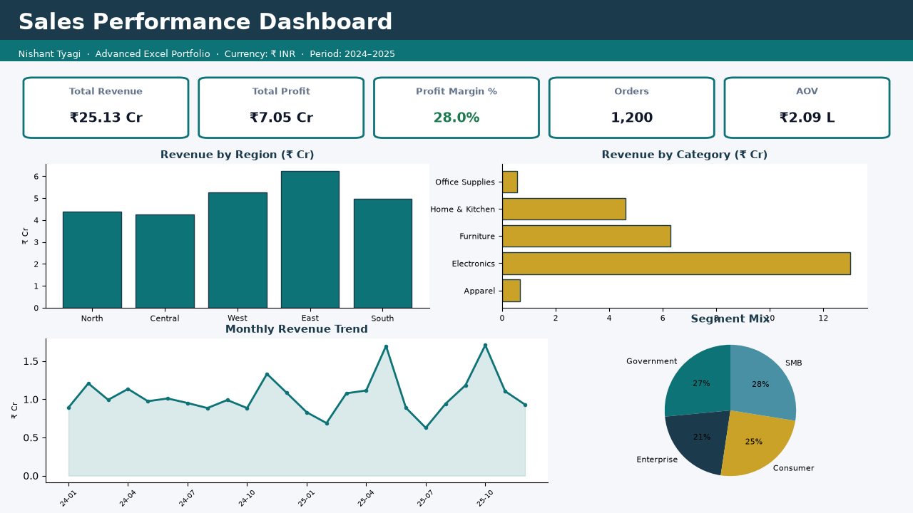
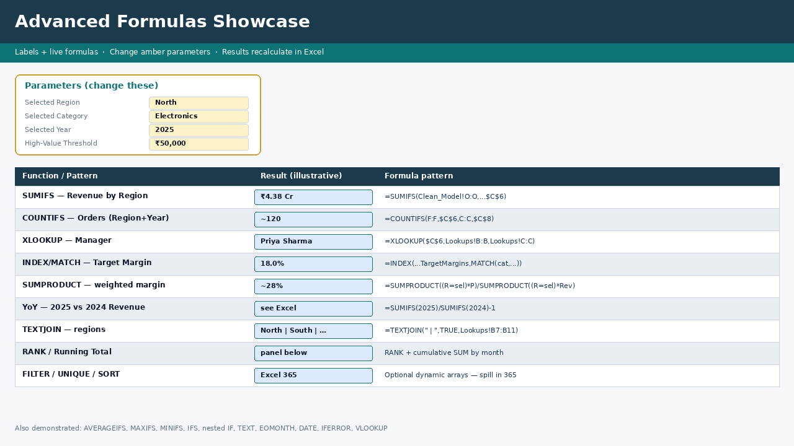

# Sales Advanced Excel — Portfolio Project

**Nishant Tyagi** · Delhi · MIS / Data Analyst track · GitHub: [nishanttyagi28](https://github.com/nishanttyagi28)

A multi-sheet Excel workbook that demonstrates **lookup models, multi-criteria aggregations, derived metrics, conditional formatting, and an executive dashboard** — with **real Excel formulas in cells** (not pre-baked values only). Built for interview walkthroughs.

| Artifact | Path |
|---|---|
| Workbook | [`Sales_Advanced_Excel_Dashboard.xlsx`](./Sales_Advanced_Excel_Dashboard.xlsx) |
| Demo video (silent, ~62s, 1280×720) | [`artifacts/sales-advanced-excel-demo.mp4`](./artifacts/sales-advanced-excel-demo.mp4) |
| Screenshots | [`screenshots/`](./screenshots/) |

> **Open in Microsoft Excel** (desktop or Excel 365). Formulas recalculate live. Currency formats use **₹ INR**.

---

## Sheet map

| # | Sheet | Purpose |
|---|---|---|
| 1 | **Instructions** | How to use + interview talking points |
| 2 | **Dashboard** | KPI cards + 4 charts (Region, Category, Monthly trend, Segment mix) |
| 3 | **Raw_Data** | 1,200 synthetic sales transactions (2024–2025) — source fact table |
| 4 | **Lookups** | Dimension tables: Region→Manager, Category→Target Margin, Segment→Priority |
| 5 | **Clean_Model** | Derived columns via formulas referencing `Raw_Data` + `Lookups` |
| 6 | **Advanced_Formulas** | Interview showcase panel: labels + working formulas + parameters |

```
Raw_Data (facts) ──► Clean_Model (formulas + XLOOKUP) ──► Dashboard (KPIs/charts)
Lookups (dims)  ──┘                          └──► Advanced_Formulas (demos)
```

---

## Where advanced functions live

### `Clean_Model` (row formulas on every transaction)

| Pattern | Example role |
|---|---|
| `YEAR` / `MONTH` | Calendar attributes from `OrderDate` |
| `TEXT` | `MonthName` as `MMM-YYYY` |
| Arithmetic | Gross = Qty×Price; Net = Gross×(1−Discount); Profit = Net−Cost |
| `IF` | Profit margin %; High-value flag (≥ ₹50,000) |
| `XLOOKUP` | Region → Manager; Category → Target Margin; Segment → Priority |
| `IFS` | Discount band: Deep / Moderate / Standard |
| Conditional formatting | Margin % green ≥20% / red <10%; Margin vs Target |

### `Advanced_Formulas` (parameter-driven showcase)

Change amber cells **C6** (Region), **C7** (Category), **C8** (Year), **C9** (High-value threshold) — results update.

| Function | Demo |
|---|---|
| **SUMIFS** | Revenue by Region; Revenue by Region+Category |
| **COUNTIFS** | Orders by Region+Year; High-value order count |
| **AVERAGEIFS** | Enterprise AOV; Margin % by Category+Year |
| **MAXIFS / MINIFS** | Peak / smallest order |
| **XLOOKUP** | Manager for selected Region |
| **INDEX / MATCH** | Target margin for selected Category |
| **VLOOKUP** | Classic manager lookup (side-by-side with XLOOKUP) |
| **IFS** | Region tier label |
| **Nested IF** | Star / Solid / Watch performance band |
| **TEXT** + **DATE** | Period label; India FY-start construct |
| **EOMONTH** | Month-end for Jan of selected year |
| **SUMPRODUCT** | Approx unique customers; weighted margin |
| **TEXTJOIN** | Pipe-joined region list |
| **RANK** | Regions ranked by revenue |
| **Running total** | Cumulative monthly revenue for selected year |
| **YoY** | 2025 vs 2024 revenue growth via SUMIFS ratio |
| **IFERROR** | Safe margin divide |

### Optional Excel 365 dynamic arrays

On `Advanced_Formulas` (bottom section):

- `UNIQUE` — distinct regions  
- `SORT(UNIQUE(...))` — sorted categories  
- `FILTER` — high-value OrderIDs for selected region  

These formulas are written into the workbook. **Open in Excel 365** (or Excel 2021+ with dynamic arrays) to see spill results. Older Excel may show `#NAME?` / limited support — that is expected, not a broken file.

> This project does **not** claim “100% of all Excel functions.” It focuses on the aggregation, lookup, logic, and date patterns most often asked in MIS / analyst interviews.

---

## Dashboard KPIs & charts

**KPIs (formula-driven):** Total Revenue · Total Profit · Profit Margin % · Orders · AOV  

**Charts:**

1. Revenue by Region (column)  
2. Revenue by Category (bar)  
3. Monthly Revenue Trend (line, 24 months)  
4. Segment Mix (pie)

Chart source tables live in columns **M–O** on `Dashboard` (also formula-driven via `SUMIF` / `SUMIFS`).





---

## Data profile

- **1,200 rows** · Order dates **Jan 2024 – Dec 2025**
- Fields: OrderID, OrderDate, Region, ProductCategory, Product, CustomerSegment, Customer, Quantity, UnitPrice, Discount, Revenue, Cost, Profit
- Regions: North, South, East, West, Central (with managers)
- Categories: Electronics, Furniture, Office Supplies, Apparel, Home & Kitchen (with target margins)
- Segments: Enterprise, SMB, Consumer, Government (with priority codes)

Synthetic but realistic Indian B2B/B2C naming for portfolio storytelling.

---

## Interview walkthrough (≈3–5 min)

1. **Dashboard** — open with the story: “Here’s the executive view; every KPI is a formula over the model.”  
2. **Advanced_Formulas** — change Region / Category / Year; show SUMIFS + XLOOKUP + YoY updating.  
3. **Clean_Model** — scroll flags + XLOOKUP Manager; point at conditional formatting on margin.  
4. **Lookups** — explain star-style dims vs facts.  
5. **Raw_Data** — source of truth; filter by Region to prove scale.  
6. Mention **Excel 365** block only if interviewer asks about dynamic arrays.

---

## Build notes

- Generated with **Python + openpyxl** (no Excel Desktop on the build machine).
- Derived metrics and demos are **cell formulas** so they calculate when you open the file in Excel.
- Demo video is a silent slideshow (title → data → formulas → dashboard → end card), H.264, no audio track.
- Rebuild: `source .venv/bin/activate && python build_workbook.py`

---

## License / usage

Portfolio sample for Nishant Tyagi. Synthetic data only — not tied to any real employer dataset.
